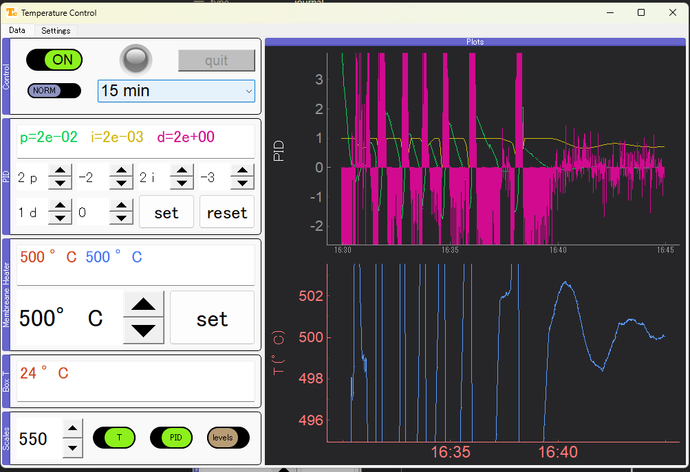

# Temperature Control
PyQt GUI for simple PID control.
Currently using [NI-DAQ (NI-9211)](https://www.ni.com/en-us/shop/model/ni-9211.html?srsltid=AfmBOoqrJxn9X2Pzmh6q8uL2X5CbkRt8O_w3xgh-Rugg1R6BV-FoM0xC) for temperature readings and [FT232H](https://www.adafruit.com/product/2264) for GPIO for windows.

## Origins
[Black River](https://github.com/Kshora/TemperatureControl) developed a working prototype based on [Control Unit](https://github.com/queezz/ControlUnit)

This repository is an upgrade of the first one.